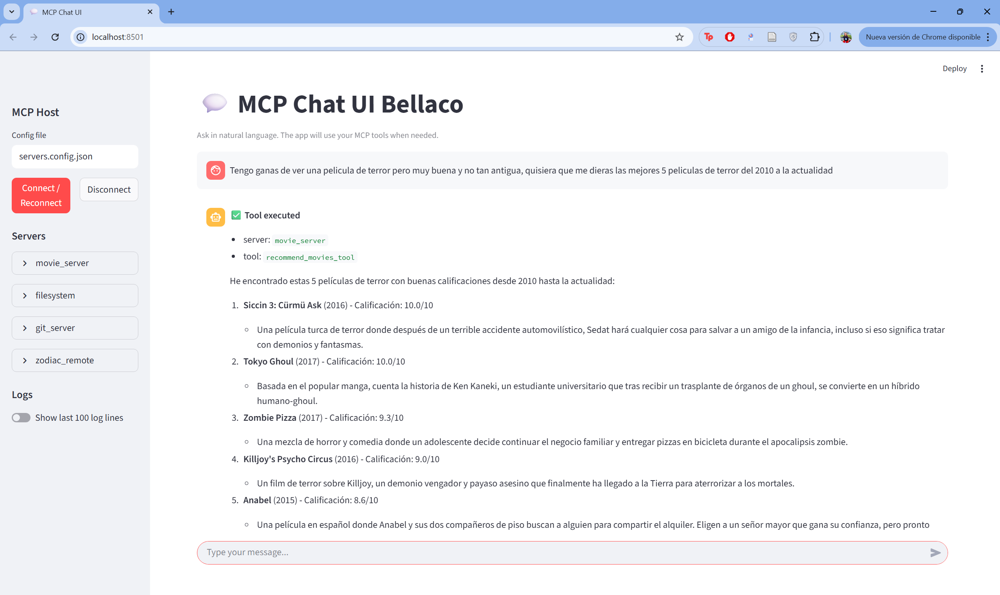

# Console + Web Chatbot Host

Natural-language **chatbot host** that connects to **multiple MCP servers** (Filesystem, Git, Movies, and a **remote Zodiac** server) and uses an **LLM API** (Anthropic by default) to decide when to call tools. It **keeps conversational context**, exposes every tool with safe names, and **logs all MCP traffic** to a JSONL file. A **Streamlit UI** is included so you can use the bot in the browser—no more console only.

> Built to match the course brief (connect to an LLM API, keep context, log all MCP interactions, use official MCP servers, add a non-trivial local server, add a remote server, and provide clear docs).&#x20;

---

## Highlights

* 🧠 **LLM-driven** tool-calling (Anthropic Claude; model configurable).
* 🧰 **Multi-MCP**: local servers (Filesystem, Git, Movies) + remote Zodiac via HTTP.
* 🏷️ **Namespaced tools** as `server__tool` (safe for provider regexes).
* 🧾 **Complete logging** to `logs/mcp_log.jsonl` (connect, list\_tools, requests, responses, LLM steps).
* 💬 **Contextful chat** (follow-ups just work).
* 🖥️ **Streamlit UI**: rich chat interface with server status and log panel.
* 🧪 **Ready-made prompts** to verify each server end-to-end.

---

## Architecture (host / clients / servers)

* **Host (this app)**: coordinates the conversation with the LLM and dispatches tool calls.
* **Clients**: small adapters in the host (STDIO and HTTP shim) to speak MCP to each server.
* **Servers**: tools you can call (local or remote). We include:

  * `filesystem` (local STDIO) – safe file ops for the project sandbox.
  * `git_server` (local STDIO) – basic Git workflow (init, add, commit, branch, log, etc.).
  * `movie_server` (local STDIO) – non-trivial analysis over datasets (search, recommend, similar, playlists).
  * `zodiac_remote` (**remote HTTP**) – returns the zodiac sign for a birthdate.

---

## Repository Layout

```
project-root/
├─ app_streamlit.py          # ← Streamlit UI
├─ chat.py                   # ← console chatbot (entry point)
├─ mcp_logger.py             # ← JSONL logger helper
├─ servers.config.json       # ← list of MCP servers to load
├─ .env                      # ← API keys and config (see below)
├─ logs/
│  └─ mcp_log.jsonl          # runtime log (created automatically)
└─ mcp_servers/
   ├─ filesystem/
   │  ├─ filesystem_server.py
   │  ├─ filesystem_sources.py
   │  └─ filesystem_models.py
   ├─ git/
   │  └─ git_server.py
   └─ movies/
      ├─ movie_server.py
      ├─ movie_sources.py
      ├─ requirements_movies.txt
      └─ datasets/
         ├─ movies_metadata.csv
         └─ keywords.csv
```

---

## Requirements

* **Python 3.10+**
* **pip** (or uv) and a working virtual environment
* **Anthropic API key** 

---

## Setup

```bash
# 1) Create and activate a venv (Windows PowerShell)
python -m venv .venv
. .\.venv\Scripts\Activate.ps1

# 2) Install core deps
pip install -r requirements.txt

# 3) Put your key in .env (next to chat.py)
# Example:
# ANTHROPIC_API_KEY=sk-ant-xxxx

# 4) Install if you want the web interface
pip install streamlit
```

> The host loads `.env` automatically.

---

## Configure MCP Servers

Open **`servers.config.json`** and list each server. The project already includes a working example—here is the structure to adapt:

```json
{
  "servers": [
    {
      "name": "filesystem",
      "command": "python",
      "args": ["mcp_servers/filesystem/filesystem_server.py", "stdio"],
      "env": {}
    },
    {
      "name": "git_server",
      "command": "python",
      "args": ["mcp_servers/git/git_server.py", "stdio"],
      "env": {}
    },
    {
      "name": "movie_server",
      "command": "python",
      "args": ["mcp_servers/movies/movie_server.py", "stdio"],
      "env": {}
    },
    {
      "name": "zodiac_remote",
      "transport": "shim",
      "url": "https://<your-cloud-run-host>/mcp",
      "headers": { "Accept": "application/json" }
    }
  ]
}
```

**Transports supported by the host:**

* `stdio` → for local servers you run as child processes.
* `shim` → **HTTP JSON-RPC** to a single `/mcp` endpoint (stateless requests). Use this when a remote server doesn’t expose the full `streamable-http` session but *does* accept JSON-RPC POSTs to `/mcp`.

---

## Run

### Console

```bash
python chat.py
```

You’ll see:

```
Chatbot MCP ready. Type /help for commands.
```

**Helpful commands**

* `/servers` – list connected servers
* `/tools <server>` – list tools for a server
* `/logpath` – show the JSONL log file
* `/history` – message count in session
* `/clear` – clear conversation context
* `/help` – show help

### Web UI (Streamlit)

```bash
streamlit run app_streamlit.py
```

Then open the local URL shown by Streamlit. The UI includes:

* Chat area (assistant messages + tool results summarized nicely)
* Sidebar with connected servers and tools
* Real-time **tail** of `logs/mcp_log.jsonl` for debugging

---

## How It Works (tool-calling loop)

1. You ask in **natural language**.
2. The LLM may return one or more `tool_use` blocks.
3. The host dispatches each `server__tool` with the given arguments.
4. Tool results are sent back as `tool_result`, and the LLM produces the final answer.
5. Every step is recorded to **`logs/mcp_log.jsonl`**.

**Example log lines (JSONL):**

```json
{"ts":"2025-09-07T19:40:01Z","event":"connect","payload":{"server":"filesystem","transport":"stdio"}}
{"ts":"2025-09-07T19:40:18Z","event":"call_tool.request","payload":{"server":"filesystem","tool":"fs_list_dir","args":{"params":{"path":".","recursive":false}}}}
{"ts":"2025-09-07T19:40:18Z","event":"call_tool.response","payload":{"server":"filesystem","tool":"fs_list_dir","structured":{...}}}
{"ts":"2025-09-07T19:40:21Z","event":"llm.final_response","payload":{"text":"Here are the files..."}}
```

---

## Verification Prompts (copy & paste)

### A) Filesystem

* “List files in the project root (non-recursive).”
* “Open `README.md` and show me the first 500 bytes.”
* “Create `notes/todo.txt` with the text `hello world`.”
* “Append `- [ ] add unit tests` to `notes/todo.txt`.”
* “Move `notes/todo.txt` to `notes/tasks.txt` and show its metadata.”
* “Find all `TODO` occurrences under `**/*.py` (max 30).”

### B) Git

* “Create a repo named `DemoRepo` inside the project.”
* “Create `DemoRepo/README.md` with `# Demo`, add it and commit with message `init`.”
* “Create and checkout branch `feature/x`.”
* “Show `git status` in `DemoRepo`.”
* “Show the last 5 commits with messages.”

### C) Movies (non-trivial local server)

* “Search for ‘Toy Story’ and list title/year/rating.”
* “Recommend Sci-Fi movies with rating ≥ 7.5 between 2000–2020 (8 items).”
* “Find 8 movies similar to ‘The Dark Knight’ by keywords.”

### D) Remote Zodiac (HTTP)

* “What’s the zodiac sign for birthdate `2001-04-15`?”
* “Check `1998-11-29` as well.”

> If your Cloud Run service is auth-protected, run the Cloud Run proxy locally, or switch the service to allow unauthenticated requests **only for testing**.

---

## Troubleshooting

* **“Forbidden/Not Found” on Cloud Run root**
  Use `/mcp` for JSON-RPC with `Accept: application/json`. The host’s `shim` transport posts directly to that endpoint.

* **“Missing session ID / 400 Not Acceptable”**
  Those errors happen with `streamable-http` GETs or wrong `Accept` headers. The **shim** transport avoids sessions: pure JSON-RPC POSTs to `/mcp`.

* **Datasets not found (Movies server)**
  Ensure CSVs are present in `mcp_servers/movies/datasets/`. Large files are ignored by VCS; place them manually if needed.

* **Nothing shows in the UI**
  Confirm your `.env` has a valid `ANTHROPIC_API_KEY`, then watch `logs/mcp_log.jsonl` for errors.

---

## How this maps to the assignment

* **LLM API connection & session context** — console and web UIs both preserve context; answers can chain references.
* **Full MCP logging** — every request/response is written to JSONL.
* **Official servers used** — Filesystem & Git are available and demonstrated.
* **Non-trivial local server** — Movies server (search, recommend, similarity, playlists) over real datasets.
* **Remote server** — Zodiac server on Cloud Run, consumed via HTTP shim.
* **UI extra** — Streamlit web front-end.&#x20;

---

## Configuration Reference

**Environment variables (.env)**

```
ANTHROPIC_API_KEY=sk-ant-...
```

**servers.config.json fields**

* `name` — logical name used for namespacing.
* `command` + `args` — how to spawn the server for **stdio**.
* `transport` — one of: `stdio`, `shim`.
* `url` — required for `shim` (e.g., `https://…/mcp`).
* `headers` — optional extra HTTP headers for `shim`.
